# Andy G "Create Leads" API Demo - Build Instructions
## Notes on contents:

This demo consists of a number of types of artefacts:
* **Demo**: Things you build/show as part of the demo e.g. The Integration Assembly, The API Flow in Designer
* **Detail** Things you *could* show as part of a more detailed demo e.g. setting up the BAR authorisation or the APIC credentials secret
* **Dependency** Things that are needed to make the demo work but which you wouldn't normally show e.g. setting up the Salesforce credentials, setting up the APIC Provider Orgs, Catalogs etc.
* **Prebuilt** Things that you want to show but save you typing e.g. The API fields/structure, the whole API flow etc. This is the 'You could watch me type, but that's boring - here's one I created earlier'

These will either be provided 'as is' or instructions will be given as to how to create them.

## Notes on Instructions Format
As people have different levels of familiarity with CP4I, the instructions will be a combination of:
1. "Just do it" - a brief description of what you need to build and why e.g. 'Create an APIC Catalog called main-demo'
1. "One I made earlier" - links to pre-built versions if available.
1. "Gotchas/Hints/Tips" or things to look out for - even for CP4I experts e.g. 'When creating the catalog, make sure you're in the correct provider org'
1. More detailed instructions and pointers
1. (Not always provided - need time!) - detailed screen flows as to how to build it step by step.

# List of things to build / Plan of Attack
## Set up / Pre Demo Items to Prepare
1. [Salesforce Connection](#salesforce)
    1. Salesforce Developer Account
    1. Salesforce Connection in Designer
1. [Slack Connection](#slack)
    1. Slack Account
    1. Slack Connection in Designer
1. [API Connect structure](#api-connect-structure)
    1. APIC Cloud
    1. Provider Organisation(s)
    1. Catalog(s)
    1. Portal(s)
    1. EMail Notification
1. [Automation Assets link to github samples](#automation-assets-link-to-github-samples)
## Demo Flow
1. [Designer 'Leads'API Flow](#designer-leads-demo-flow)
    1. API Specification/Fields
    1. API Flow
    1. Export the BAR File
1. [Leads API Integration Assembly](#leads-api-integration-assembly)
    1. Create the Assembly (This can be done AFTER the barauth, configuration and connection secrets are created - this gives the 'Re-use template, rename items, it just works' effect)
    1. Create the barauth file
    1. Create the salesforce and slack connection Configuration
    1. Create a connection secret to APIC
    1. Create an integration runtime
    1. Create a declarative Product API

## Salesforce
### 1. Developer Account
**Category**: Dependency

You'll need to create (or re-use) a developer account on Salesforce so your API has something to 'talk to/integrate with' and also so that you can demo the assembly deploying the credentials/account configuration as well as the API itself.

Go to https://developer.salesforce.com/free-trials - make sure you sign up for a *developer* account, not a regular trial, or it won't work... This is a common gotcha.

You will need the following:
* **URL** - note that this will NOT be https://salesforce.com - it will be something like https://abc123.salesforce.com and will be different depending on your account - it won't be the same as someone elses - or mine.
* **userID** - this will be what you log on with
* **password** - the one you log on with but see note about password=password+token when entering into designer accounts below
* token - TIP this will usually be sent in an email to you. If you need to change your salesforce password, your token will change at the same time and you will be sent a new one.
* clientID/ClientKey (if you see these terms, they are both the same)
* clientSecret
### 2. Designer Connection Account Details
**Category**: Dependency / Detail

In App Connect Designer, go to the 'Catalog' and choose 'Salesforce' (just the 'Salesforce' one, not the sales cloud etc) and create a new account.

If you want to use one of my pre-built flows, call the account "App Connect Trial" (note case sensitive)

**Tip/Gotcha**: Where it says 'Password' this is your Salesforce Password concatenated with your Salesforce Token e.g. `MyPasswordMyToken` in the App Connect 'Password' field.

## Slack Connection
### 1. Slack Account
**Category**: Dependency

You will need you own workspace/instance of Slack - trying to connect to an enterprise instance will mean that you will need workspace admin credentials which you may not have if you work in a large company (like IBM!). For production integration, you can get these set up but for a demo or exploring/education, it's easier to create your own slack instance that you own - that's what I did.

### 2. Slack Connection Account Details
**Category**: Dependency / Detail

In Designer, you'll need to create a connection account to your slack instance. This can be very complicated but at the end what you need is a slack token. *This does not expire, so keep it in a safe place and you can re-use it for any number of demos.*

Instructions as to how to create one of these are documented here: https://www.ibm.com/docs/en/app-connect/containers_cd?topic=slack-connecting-from-containerized-environment

**Tip**: When following the docs, make sure you use the instructions for the containerised/CP4I version of designer - not the ones for the SaaS version as these are different.

Also,you don't need to enter your slack workspace name or anything even though you feel you should - your token is enough.

## API Connect Structure
### 1. APIC Cloud
**Category**: Dependency

It doesn't really matter what this is called, use the 'small' template on the operator in the absence of anything else and just create an instance. If you are using the '1-click' install on ROKS, your instance will be called 'ademo'

Tip - if you get asked for a backup S3 bucket, add the following to your CR so you can override it:
```
metadata:
  annotations:
    apiconnect-operator/backups-not-configured: 'true'
```
### 2. Provider Organisation
**Category**: Dependency

For this demo, we just need one provider org. If you want to use my namings or if you are using '1-click' the the provider org is `main-demo`
### 3. Catalog
**Category**: Dependency

For this demo, we just need one catalog. If you want to use my namings or if you are using '1-click' the the provider org is `main-demo-catalog`. Make sure this catalog is in the `main demo` provider org.

Not sure if it makes any difference but for this demo, we don't use spaces (syndication) in the catalog
### 4. Portal
**Category**: Dependency

APIC uses a 'one catalog, one portal' structure - create a portal for the catalog that you use.

To set up a portal, go to **API Manager ->Choose-your-provider-org-from-the-top-right-menu -> Manage Catalogs -> Your-Catalog-Name -> Catalog Settings -> Portal**.

### 5. Email Notification
**Category**: Dependency

When you create an APIC portal, to create an app and subscription to an API you will need to sign up to the developer portal as a consumer organisation. To do this, you can 'create an account' but APIC will need to send you an email to verify/activate your account. Hence APIC will need an SMTP server to use to send you that email.

To set up the email, go to **API Management Administration / Cloud Manager -> Configure Cloud -> Notifications -> Edit email server -> Congfigure Email server**. Once you have it configured,  set it as the defaul in **Notifications/Edit email server**

## Automation Assets link to github samples
The ideal way to do 'Here is one I built earlier' is to import things from Automation Assets (FKA 'Asset Repo').

In this demo we can import the following things:
* Designer flow (both partial and complete flows)
* Integration Assembly (For the declarative APIs)

We can link the Automation Assets (FKA Asset Repo) to github where the samples are so that they automatically appear in Automation Assets.

To do this, create a remote in Automation Assets:

1. Click on 'remotes' in the Automation Assets UI.
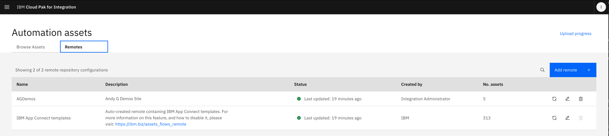

2. Now add the `https://github.com/andygblue/agdemos` URL to the remote and use the main branch like below

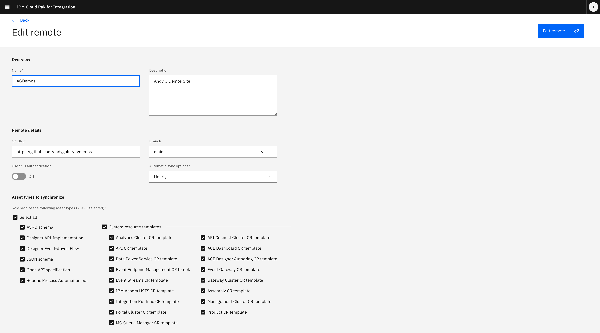

Now the assets for this demo will appear in Automation Assets and can easily be re-used in CP4I.

## Designer 'Leads' Demo Flow
### 1. API Specification/Fields
**Category**: Demo/Prebuilt

Create a 'leads' API in Designer with a model of 'leads' with a number of fields such as name, email etc These should be similar but not identical to the Salesforce 'leads' object - use 'city' and 'town' for example as a way of showing that mapping assist is not just a 1-1 field match.

This can be done as part of the overall API flow to demo the 'You don't need to know OpenAPI/Swagger to use this', but to save on time/typing it's often easier to say 'Here's one I created earlier' and import the API structure from Automation Assets then create the flow implemenation. The asset is called `AG Demo Lead API Structure Template` and is of type `Designer API Implementation` - it's just the model fields with no flows.

To do this, do 'Create a flow by describing an integration' in designer and select the `AG Demo Lead API Structure Template` asset. You'll see the model structure created for you in designer when you import.

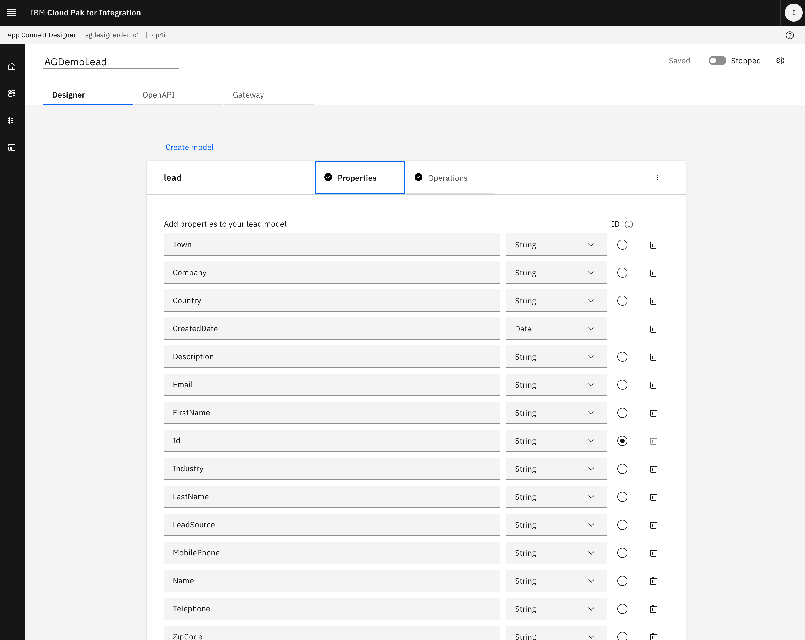


### 3. API Flow
**Category**: Demo/Prebuilt

Implement the 'leads' API flow in Designer with operations of 'Create Lead (POST)' and (optionally) 'Retrieve Lead by ID (GET)'.

The 'create' flow takes the fields in your API model, maps them to the Salesforce connector 'Create Lead', updates Salesforce and also sends a slack message to let you know a new lead has been created. It then returns the data back to the API flow.

The 'retrieve' flow gets the lead from Salesforce corresponding to the lead ID and sends the details back to the requester.

This can be built as part of the overall demo but depends on what you are demoing - if you want to show 'build, test, deploy' then use the Integrated Authoring in Designer as part of the demo and implement the flows yourself but if you want to focus on assemblies and automated deployment or declarative APIs then to save on time/typing it's often easier to say 'Here's one I created earlier' and import the whole completed flow from Automation Assets ready to run. The asset is called `AGDemoLead` and is a 'superset' of the `AG Demo Lead API Structure Template` asset with all of the flows created and mappings already done.

Note that the pre-built flow uses accounts called 'App Connect Trial' for both Salesforce and Slack. If you want to use the pre-built flows, then you'll need to make sure your accounts are called that - you can rename them from 'Account1' or create additional accounts if you need to.


Asset tile for pre-built leads flow
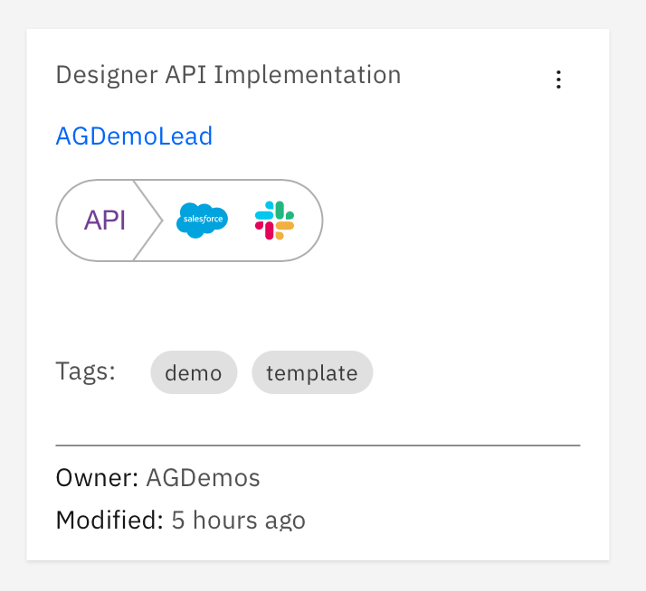

Pre-built leads flow showing operations
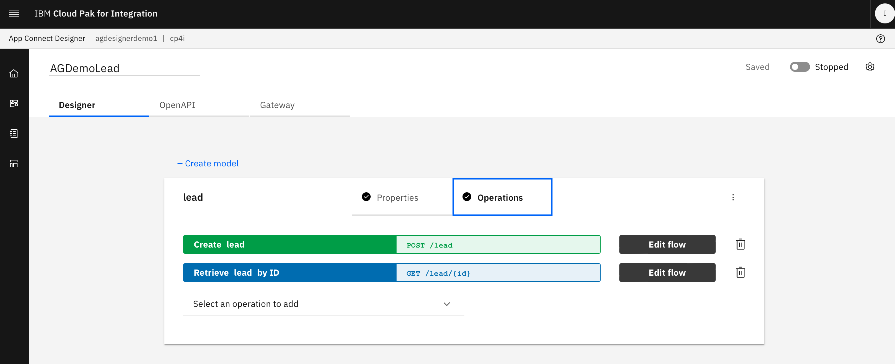

Pre-built leads flow showing the 'create' flow
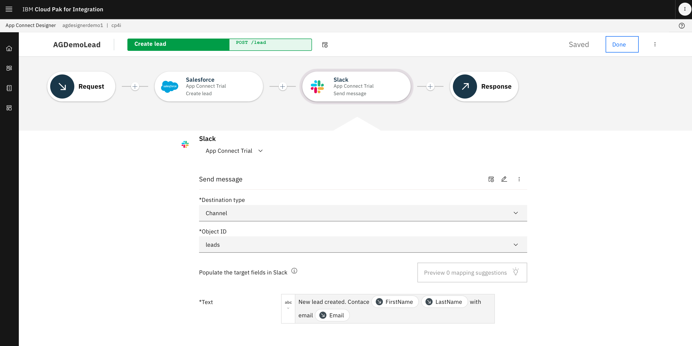

### 3. Export and store the BAR file
**Category**: Demo/Prebuilt

This can be done as part of the overall demo but depends on what you are demoing - if you want to show 'build, test, deploy' as an overall flow then use the Integrated Authoring as part of the demo and export the BAR file but if you want to focus on assemblies and automated deployment or declarative APIs then to save on time/typing you can re-use the provider BAR file and go directly to the Integration Assembly. The asset is called `agdemolead.bar` and is downloadable from https://github.com/andygblue/agdemos/raw/main/LeadsAPI/BARFiles/agdemolead.bar or at [Here](../BARFiles/agdemolead.bar)

Again, note that the pre-built BAR file uses accounts called 'App Connect Trial' for both Salesforce and Slack. If you want to use the pre-built BAR, then you'll need to make sure your accounts are called that - you can rename them from 'Account1' or create additional accounts if you need to.

To store the BAR file, you'll need something that can be accessed via HTTP. You can use the internal BAR store (upload the BAR file using the App Connect Dashboard), github or an S3 object store. Make sure you can access it with an http(s) URL.

## Leads API Integration Assembly
### 1. Create the assembly
**Category**: Demo/Prebuilt

If you want to build everything yourself, Create a blank assembly - to do this select the 'quickstart' assembly and delete the queue manager and kafka server that are pre-populated - you won't need them.

Tip/Gotcha: *Immediately go into the assembly and rename it before you do anything else* - otherwise you will end up with one called ia-quickstart and *you can't rename an k8s deployment once you've created it*!

The recommended path is to use an API Assembly Template from Automation Assets - mine is called `agapitemplate1` and is of type `Assembly CR Template` - use 'Import from assets' when creating your assembly to use it.

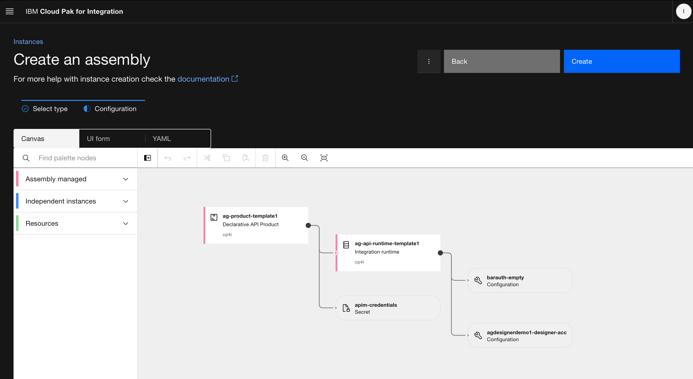

It creates an assembly with a Declarative API product, an Integration runtime, a barauth file to connect to the BAR file, an APIC connection to connect to APIC and an App Connect Configuration to store the Salesforce and Slack credentials. You must create the barauth, Configuration and APIC Credentials for the assembly to work...

### 2. Create the barauth file
**Category**: Detail/Prebuilt/Dependency

This depends on where you want to put your BAR file - if you want to use it direct from github, you'll still need a barauth configuration to allow your integration runtime to connect to it - even though there is no need for any autehntication.

You can use this as part of a detailed 'How does this acutally work??' deep-dive but for a 'build this' demo, as you only ever need one across all your integration runtimes, it's fine to do a 'this is one we built earlier' and reference it. 

If you want to use these from automation assets, use 'download' to get the YAML then either do `oc apply -f filename` or do 'new from YAML' in the OpenShift console to apply them.

```
apiVersion: appconnect.ibm.com/v1beta1
kind: Configuration
metadata:
  name: barauth-empty
  namespace: cp4i
  labels:
    backup.appconnect.ibm.com/component: configuration
    bcdr-candidate: t
spec:
  description: 'Authentication for public GitHub, no credentials needed'
  secretName: barauth-empty-dj8p5
  type: barauth
  version: 12.0.8.0-r2
```

This is in github/automation assets as `configuration-barauth-empty.yaml`

You also need a corresponding secret:

This has a single value of `{"authType":"BASIC_AUTH","credentials":{"username":"","password":""}}` - exactly that, you don't need to add any credentials. It looks like this - you can re-use the date below - the base64 is just the above string encoded.

```
kind: Secret
apiVersion: v1
metadata:
  name: barauth-empty-dj8p5
  generateName: barauth-empty-
  namespace: cp4i
  labels:
    app.kubernetes.io/component: configuration
    app.kubernetes.io/instance: barauth-empty
    app.kubernetes.io/managed-by: ibm-appconnect
    app.kubernetes.io/name: barauth-empty
    appconnect.ibm.com/kind: Configuration
    backup.appconnect.ibm.com/component: configuration
    bcdr-candidate: t
    release: barauth-empty
data:
  configuration: >-
    eyJhdXRoVHlwZSI6IkJBU0lDX0FVVEgiLCJjcmVkZW50aWFscyI6eyJ1c2VybmFtZSI6IiIsInBhc3N3b3JkIjoiIn19Cg==
type: Opaque
```

This is in github/automation assets as `configuration-barauth-empty.yaml`


### 3. Create the salesforce and slack credentials Configuration
**Category**: Demo/Detail/Prebuilt/Dependency
In a typical deployment, there would be one salesforce and slack connection/account configuration across many integration runtimes, so it's fine to have this as a prebuilt component 'one I built earlier'

One thing that should be part of the demo is to reference it in the assembly and show how easy it is to 'bind' the configuration to the integration runtime in the assembly and deploy them together. Even if you've pre-built it, you should demo it being referenced in the assembly.

Make sure you call it **#TODO - update this to give it a better name** ``to make sure the pre-built assets work with it - or you can update the template to reference your preferred name.

There are 3 options to create the Configuration
1. Create accounts in Designer and re-use those
This is probably the easiest for the demo - and it's what I've used in my example. If you look in the same namespace as designer, you'll see a Configuration called something like like `<your designer instance name>-designer-acc` - (mine is `agdesignerdemo1-designer-acc`). You can reference this in your assembly.
**Tip* to find Configurations in OpenShift - use 'Search' and filter on 'Configuration' CRs.
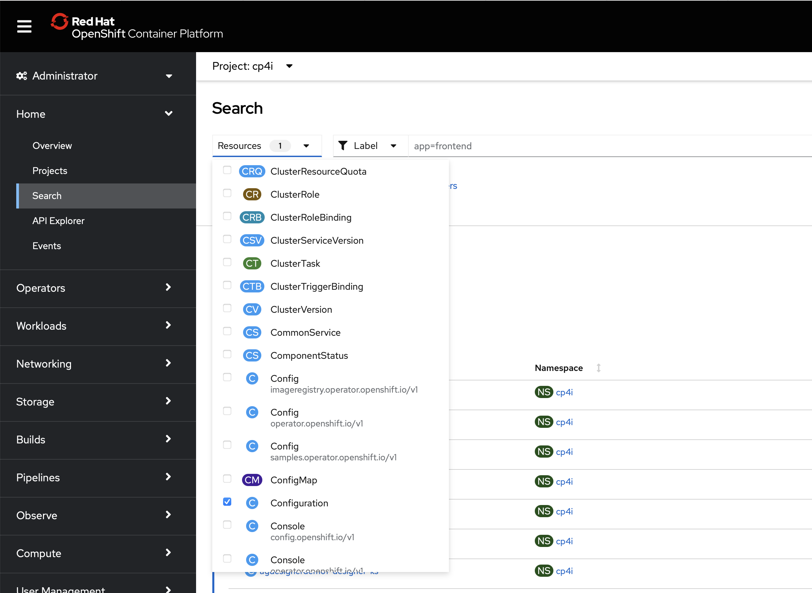

2. Create a Configuration in the ACE Dashboard.
If you want a different account than designer uses - maybe to show how different accounts/credentials are used in different environments e.g. DEV/TEST/PROD etc then you can create Configurations in the ACE Integraion Dashboard.

Go to the 'Configuration' screen (use the spanner/wrench icon) and you can see all of the Configurations - you'll need to create an 'Accounts' type Configuration with your Salesforce and Slack credentials in it.
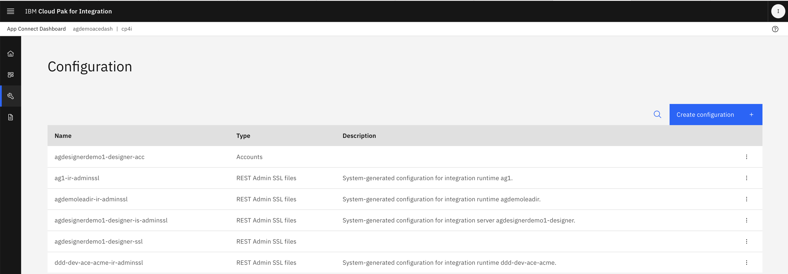

3. Create the configuration and secret directly in Openshift/k8s.
The credentials are just plain text at the end of the day. There are two CRs: A configuration CR which references a Secret with the actual credentials. They look like this:

Account Configuration CR: #TODO check how a non-designer one looks
My example is `configuration-agdesignerdemo1-designer-acc.yaml`

```
apiVersion: appconnect.ibm.com/v1beta1
kind: Configuration
metadata:
  name: agdesignerdemo1-designer-acc
  namespace: cp4i
  ownerReferences:
    - apiVersion: appconnect.ibm.com/v1beta1
      blockOwnerDeletion: true
      controller: true
      kind: DesignerAuthoring
      name: agdesignerdemo1
      uid: fb1ce394-f76f-418f-aa68-18b0d94d1429
  labels:
    app.kubernetes.io/component: accounts
    app.kubernetes.io/instance: agdesignerdemo1
    app.kubernetes.io/managed-by: ibm-appconnect
    app.kubernetes.io/name: agdesignerdemo1
    appconnect.ibm.com/kind: DesignerAuthoring
    backup.appconnect.ibm.com/component: designerauthoring
    bcdr-candidate: t
    release: agdesignerdemo1
spec:
  secretName: agdesignerdemo1-designer-acc
  type: accounts
```

This references the account secret CR
Account Secret CR:
```
kind: Secret
apiVersion: v1
metadata:
  name: agdesignerdemo1-designer-acc
  namespace: cp4i
  labels:
    app.kubernetes.io/component: accounts
    app.kubernetes.io/instance: agdesignerdemo1
    app.kubernetes.io/managed-by: ibm-appconnect
    app.kubernetes.io/name: agdesignerdemo1
    appconnect.ibm.com/kind: DesignerAuthoring
    backup.appconnect.ibm.com/component: designerauthoring
    bcdr-candidate: t
    release: agdesignerdemo1
  ownerReferences:
    - apiVersion: appconnect.ibm.com/v1beta1
      kind: DesignerAuthoring
      name: agdesignerdemo1
      controller: true
      blockOwnerDeletion: true
data:
  configuration: >-
    YWNjb3VudHM6CiAg......
type: Opaque

```

The 'configuration' entry is base64 - if you edit in the OpenShift UI, you'll see that it's your accounts information as a JSON string like below

```
accounts:
  salesforce:
    - name: App Connect Trial
      endpoint:
        loginUrl: https://um1.salesforce.com
      credentials:
        authType: OAUTH2_PASSWORD
        username: <YourUserName>
        password: <YourPassword+YourToken>
        clientIdentity: >-
          <YourClientID>
        clientSecret: <YourClientSecret>
      authType: OAUTH2_PASSWORD
  slack:
    - name: App Connect Trial
      endpoint: {}
      credentials:
        authType: BASIC_OAUTH
        accessToken: >-
          <<Your Slack Access Token>>
      authType: BASIC_OAUTH
```

### 4. Create a connection secret to APIC
**Category**: Detail/Prebuilt/Dependency
This is a key component to make declarative APIs work - it's how declarative APIs integrate with APIC - they need credentials to be able to 'push' those APIs and Products into the APIC instance.

For reference, documentation on this is here: https://www.ibm.com/docs/en/cloud-paks/cp-integration/2023.4?topic=integrations-using-declarative-api-products

You only need one of these per APIC instance, so once you've set it up, it will work for any number of declarative APIs and Products.

This is something that can't be shipped as a pre-built asset as it contains configuration and credentials, so it's a good candidate for 'here's one I built earlier'

If you want to use the prebuilt assembly with this demo, then make sure you call your secret `apim credentials`

The credentials will need to use the local cloud manager user registry. This means you will need to use the APIC api_key authorisation method as the local cloud manager registry uses Keycloak which is an OIDC provider - this means we can't use userid/password authentication.

You'll need to create a secret like this:
```
kind: Secret
apiVersion: v1
metadata:
  name: apim-credentials
  namespace: cp4i
data:
  base_url: >-
    <baseURL>
  grant_type: api_key
  api_key: <myapiKey>
  trusted_cert: >-
    <mytrustedcert>
type: Opaque
```
**TOP TIP**
The values in the secret need to be base64 encoded which can be a pain. Your secret will end up looking something like this:
```
kind: Secret
apiVersion: v1
metadata:
  name: apim-credentials
  namespace: cp4i
data:
  api_key: PFJlcGxhY2Ugd2l0aCBZb3VyIEFQSSBLZXkgZnJvbSBBUElDPg==
  base_url: >-
    PFJlcGxhY2Ugd2l0aCBZb3VyIGJhc2UgVXJsIC0gbGlrZSBodHRwczovL3NtYWxsLW1nbXQtcGxhdGZvcm0tYXBpLWNwNGkubXlzZXJ2ZXJuYW1lLmNvbS8gPg==
  grant_type: YXBpX2tleQ==
  trusted_cert: >-
    LS0tLS1CRUdJTiBDRVJUSUZJQ0FURS0tLS0tClJlcGxhY2Ugd2l0aCB5b3VyIGNlcnRpZmljYXRlIGRldGFpbHMgaGVyZQotLS0tLUVORCBDRVJUSUZJQ0FURS0tLS0t
type: Opaque
```

The easy way to deal with this is as follows:

1. Create the secret by copying mine from here https://github.com/andygblue/agdemos/blob/main/LeadsAPI/Templates%20and%20Examples/secret-apim-credentials.yaml in github (Or the above code block) into the YAML view in OpenShift: You'll see 'base64' entries for the field.
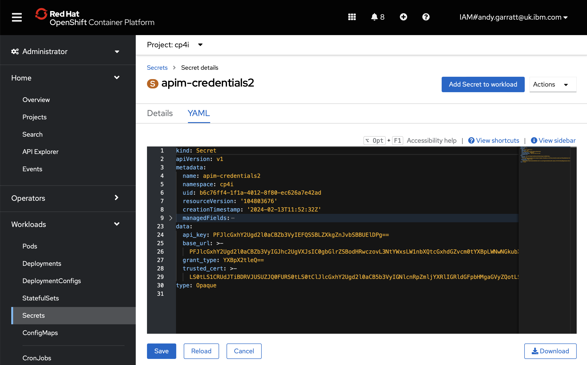
2. Now go into the UI view and use 'Actions->Edit Secret' - you'll see the base64 become readable text and they you can replace my values with yours - the UI will automatically base64 encode them for you.
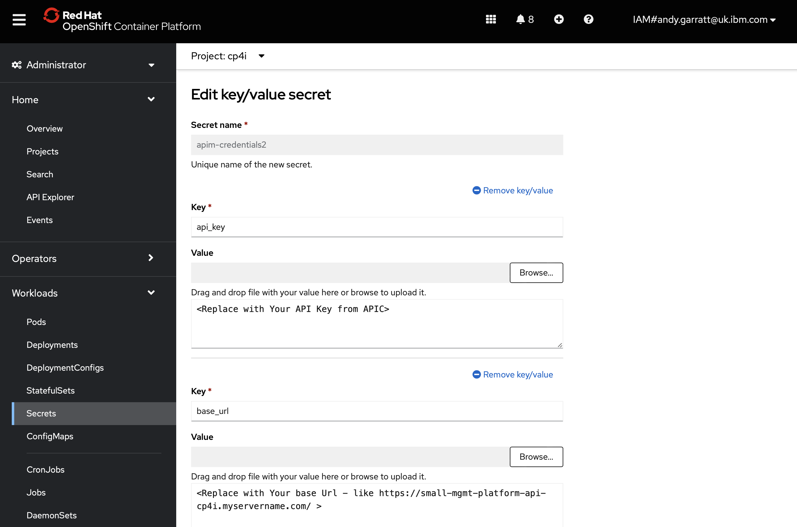

**Field Values**


`base_url`: This is the URL that you log into the APIC Cloud management/admin server (not the API manager for the individual provider orgs) - it will look something like `https://small-mgmt-platform-api-cp4i.<myservername.com>/` - make sure you keep the last '`/`' on the end and you don't have any paths after the `/`

`grant_type`: This is always '`api_key`' keep this as this text - do not put your api key here

`api_key`: this is your actual API key - instructions as to how to get this below.

`trusted_cert`: this is a certificate you need to give to APIC to show that it can trust you - instructions below

#### Creating an APIC API Key
Instructions for this are in the documentation here: https://www.ibm.com/docs/en/api-connect/10.0.x?topic=applications-managing-platform-rest-api-keys but *here are two things to make sure you do:*
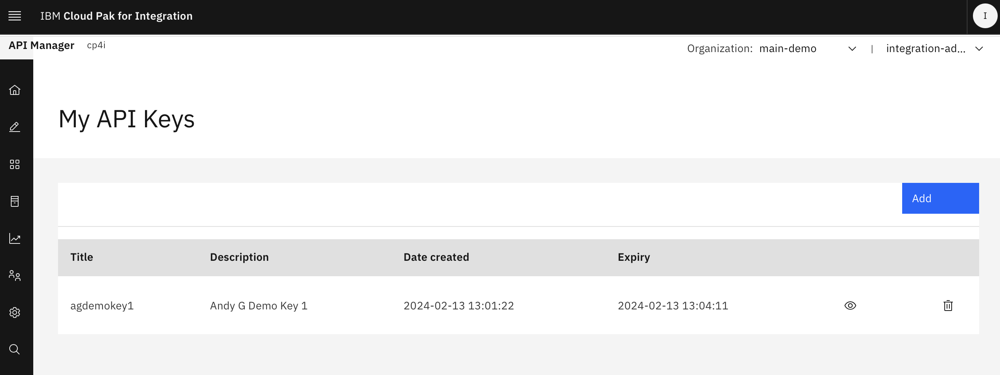
1. Make sure you tick the 'make the API key reusable' box - otherwise the declarative APIs function in CP4I won't work. By default, each API key can only be used once and CP4I assemblies and canvas need to use them many times.
2. Extend the expiry of the API key to something useful (weeks? months? years?) otherwise you'll need to keep recreating it.

Do this in API Management Admistration (cloud manager) -> Settings -> Onboarding -> API key timeout:
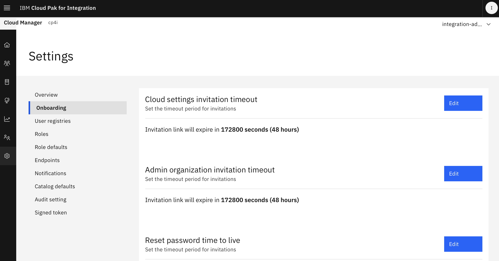

Scroll down to '`API key timeout`'

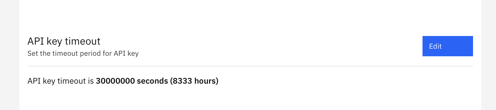

Click '`Edit`' and you can set the '`multiple use of apikey`' box.
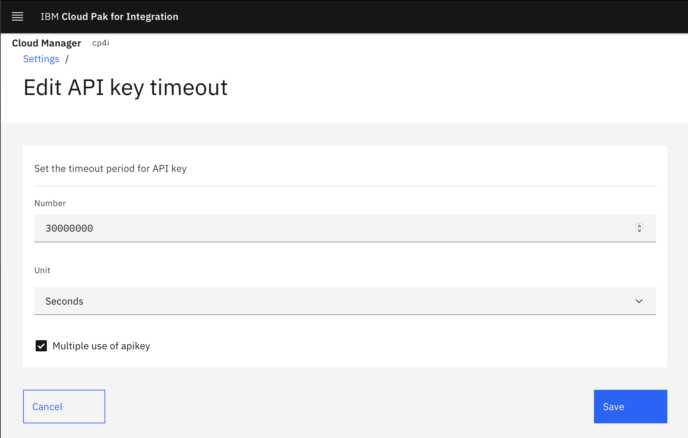

Docs for this are here https://www.ibm.com/docs/en/api-connect/10.0.x?topic=settings-configuring-api-key

#### Creating an APIC trusted certificate
Follow the instructions in the docs here https://www.ibm.com/docs/en/cloud-paks/cp-integration/2023.4?topic=integrations-using-declarative-api-products in the section *Create a secret with your API manager credentials*

(If you get '`jq not found`' or similar, you'll need to install `jq` onto your laptop.)

### 5. Create/Review the Integration Runtime
**Category**: Demo

This is a key part of the demo:
1. If you want to use the pre-built template (And you do!) then import the `agapitemplate` Assembly CR template from Automation Assets.
1. If you're not using the template from Automation Assets Drag a managed integration runtime onto the canvas
1. Double-click the runime to Open the properties
1. Rename the integration runtime to `demolead`
1. Add the BAR file URL into the CR - tip: Make sure you hit 'enter' to make sure it's entered. This is how you tell the runtime to use your flow. You can use my github version of the BAR file here: https://github.com/andygblue/agdemos/raw/main/LeadsAPI/BARFiles/agdemolead.bar or point to where your BAR file is.

Example below showing the BAR URL, barauth and slack/salesforce configuration added to the runtime.

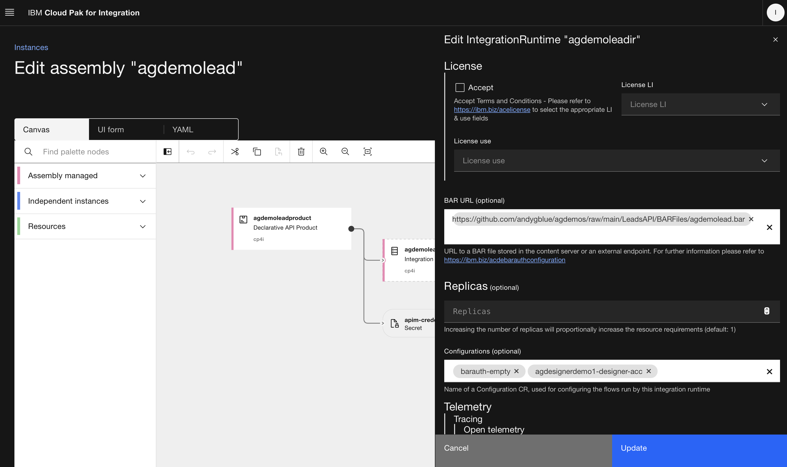

6. Add the Salesforce/Slack Configuration Name to the Runtime - tip: Make sure you hit 'enter' to make sure it's entered. This is how you add the Salesforce and slack credentials to your flow.
7. Add the Bar Authorisation Secret Name to the Runtime - this allows the integration runtime to connect to git (or wherever)
8. Save the runtime by pressing 'Update'.

If you want you can link the configuration and barauth using the drag/drop lines on the canvas. The effect is the same.

You can view the YAML for the runtime and see the same links:

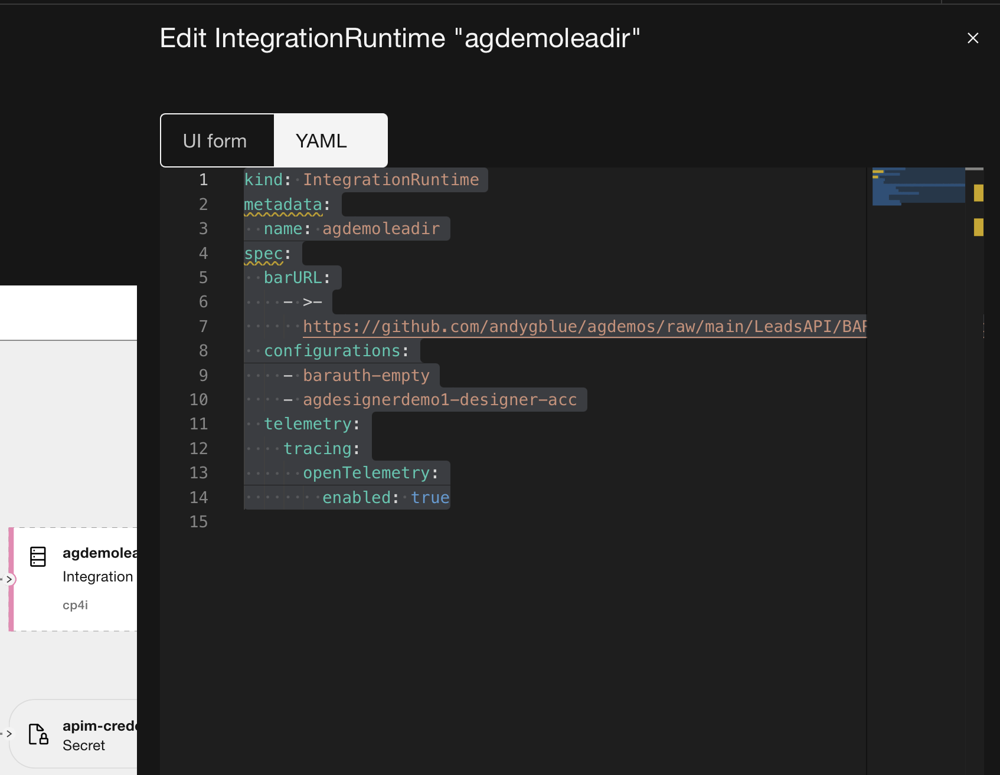

```
kind: IntegrationRuntime
metadata:
  name: agdemoleadir
spec:
  barURL:
    - >-
      https://github.com/andygblue/agdemos/raw/main/LeadsAPI/BARFiles/agdemolead.bar
  configurations:
    - barauth-empty
    - agdesignerdemo1-designer-acc
  telemetry:
    tracing:
      openTelemetry:
        enabled: true
```

### 6. Create a declarative API Product
**Category**: Demo/Prebuilt

1. If you are using the `agapitemplate` template them you already have this. If you're building from scratch then drag a new managed declarative api product onto the canvas.
1. Double-click to open the declarative API product
1. Rename the API Product to be `agdemoleadproduct` or similar

**IMPORTANT NOTE** The name of the declarative API Product CR (i.e. what you're opening here) is NOT the name/title of the API Product as it will appear in APIC - you'll need to check that's correct as well.

4. Review/edit the Provider `Organization` and `Catalog` for the API Product. Make sure that matches what you have set up in APIC.
5. From the template, the default state of the API Product is `Staged` - either change this now to `Published` so that it shows up in the APIC portal, or use this as a way of showing 'Look, I've updated the assembly - watch how the state changes from `Staged` to `Published` in APIC when I do..'
6. ** Important ** in the Definition->APIs section, make sure that the 'Integration Runtimes' name matches the name you have for your runtime in the assembly. If you want, you can do drag/drop and wire the product to the integration runtime visually and it will update this. If you don't have this matching correctly, the auto-binding between Product and Runtime won't work..check that the line 

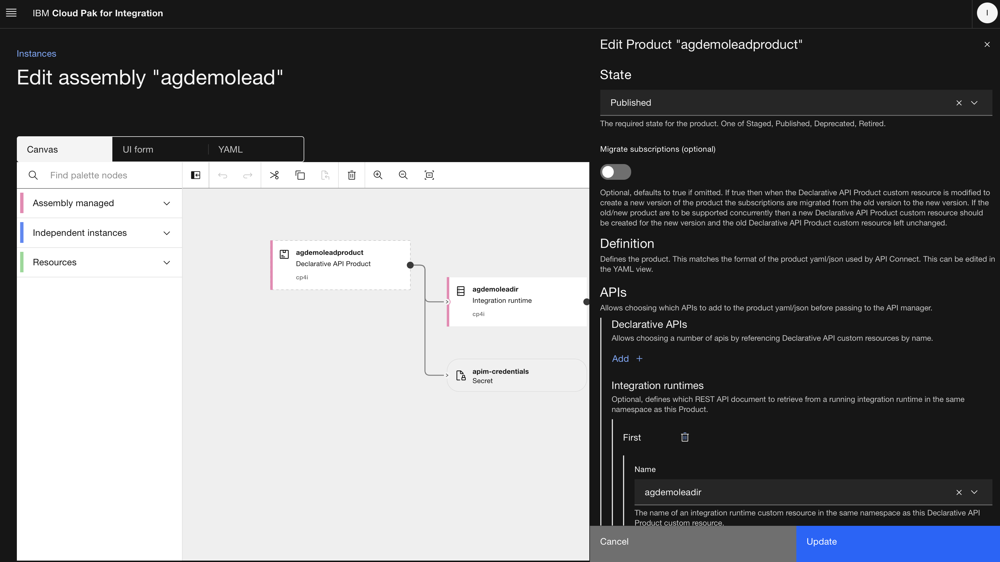

7. Now go to the YAML view in the Product screen and review the API Product `plan`. Currently the plan is only visible in the YAML view, not the product view. If you're using the template then this is already populated for you with a Default Plan of 100 calls per hour. If you're building from scratch, you'll need to add the plan to the YAML - either copy from the template or from the text below.
8. In the YAML view, also create/review the API Product `name`, `title` and `version` - as above, note that the name and title are NOT the same as the CR/Declarative product name. These are the values that will be pushed to and appear in APIC. If you're creating from scratch, copy the format from the template or below.

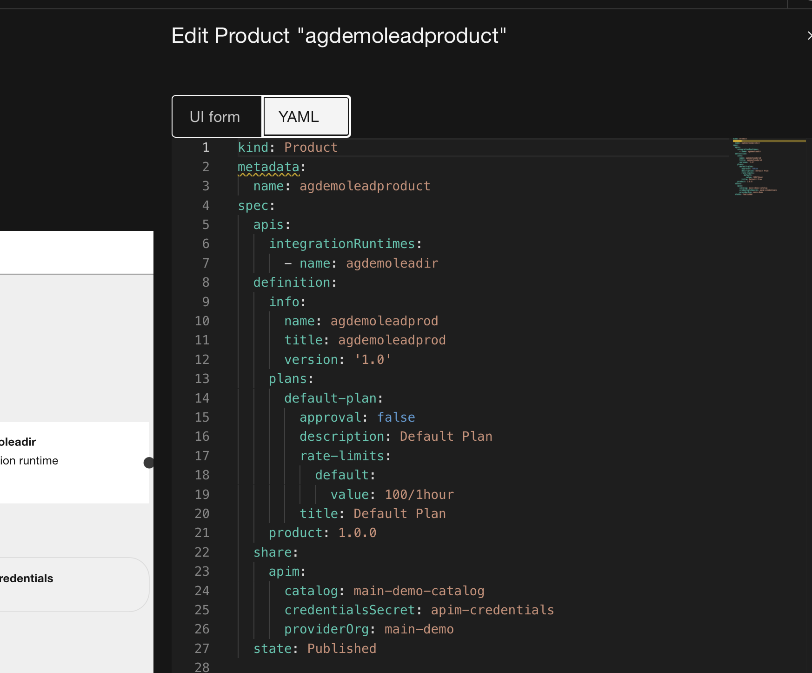

```
kind: Product
metadata:
  name: agdemoleadproduct
spec:
  apis:
    integrationRuntimes:
      - name: agdemoleadir
  definition:
    info:
      name: agdemoleadprod
      title: agdemoleadprod
      version: '1.0'
    plans:
      default-plan:
        approval: false
        description: Default Plan
        rate-limits:
          default:
            value: 100/1hour
        title: Default Plan
    product: 1.0.0
  share:
    apim:
      catalog: main-demo-catalog
      credentialsSecret: apim-credentials
      providerOrg: main-demo
  state: Published
```

### 7. Deploy your assembly
At this point, hit 'create' and you should be good to go!